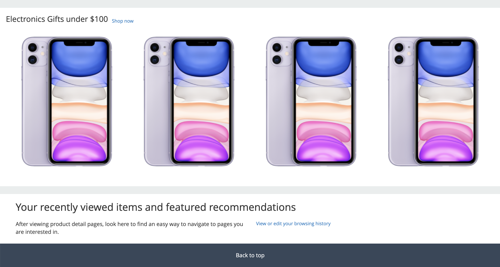

# Amazon Theme for Magento 2

The repository includes Home Page implementation of the Amazon.com website for Magento 2.

## Installation

Enable theme via Magento Admin -> Content -> Design -> Configuration page.
